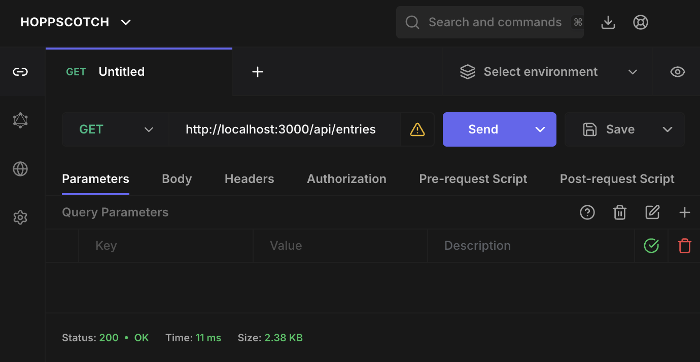

# web_architecture_VIS2026

## Braucht eure App SSR/Next.js – oder wäre Vite eigentlich besser geeignet? Begründet anhand von SEO und Interaktivität.

A: Für meine Travel-Diary-App ist Vite aktuell besser geeignet, weil die App vor allem interaktiv ist (z.B. Orte auswählen und Einträge hinzufügen). SEO ist hier nicht so wichtig, da es keine öffentliche Website ist. Next.js wäre erst sinnvoll, wenn Inhalte über Suchmaschinen gefunden werden sollen.

## Ressourcen & API-Design

### Ressourcen
- **entries**: Hauptressource der App (Reisetagebuch-Einträge)
- **places**: Sekundäre Ressource (Orte)

### Hierarchie
- Ein **place** hat viele **entries** (1:n)
- Ein **entry** gehört genau zu einem **place** über `placeId`

### API-Entscheidung (flat vs. nested)
- Die CRUD-Operationen laufen zentral über **/api/entries**
- Für den Ortskontext gibt es ergänzend verschachtelte Endpunkte wie **/api/places/:placeId/entries**

### Kurzbegründung
Dieses gemischte Design hält die Hauptlogik einfach und einheitlich (flat) und macht Beziehungen zwischen Orten und Einträgen trotzdem klar lesbar (nested). Dadurch bleibt die API leicht verständlich und gut erweiterbar.

## CRUD-API

### Ressource
Die CRUD-API in diesem Abschnitt bezieht sich nur auf die Hauptressource **entries**.

### Endpunkte
- `GET /api/entries` - alle Einträge abrufen
- `GET /api/entries/:id` - einen Eintrag über die ID abrufen
- `POST /api/entries` - neuen Eintrag erstellen
- `PUT /api/entries/:id` - bestehenden Eintrag aktualisieren
- `DELETE /api/entries/:id` - Eintrag löschen

### Pflichtfelder (bei Erstellung/Aktualisierung)
- `placeId`
- `title`
- `description`
- `rating`
- `category`

### Statuscodes
- `201` bei erfolgreichem Erstellen
- `204` bei erfolgreichem Löschen
- `404`, wenn ein Eintrag nicht gefunden wurde
- `400`, wenn Pflichtfelder fehlen

## API-Tests (ohne Frontend)

### Ziel
In diesem Schritt werden nur die 5 CRUD-Endpunkte der Ressource `entries` mit Hoppscotch getestet.
Basis-URL: `http://localhost:3000`

### Hoppscotch-Testplan
- Pro Endpoint genau 2 Tests durchführen: 1x Erfolgsfall, 1x Fehlerfall
- Für jeden Test den Statuscode prüfen

### Testfälle

#### 1. GET /api/entries
Erfolgsfall:
- Methode/URL: `GET http://localhost:3000/api/entries`
- Erwartet: `200`

Fehlerfall:
- Methode/URL: `GET http://localhost:3000/api/entries-invalid`
- Erwartet: `404`

#### 2. GET /api/entries/:id
Erfolgsfall:
- Methode/URL: `GET http://localhost:3000/api/entries/:id` (mit existierender `id`)
- Erwartet: `200`

Fehlerfall:
- Methode/URL: `GET http://localhost:3000/api/entries/entry_does_not_exist_999`
- Erwartet: `404`

#### 3. POST /api/entries
Erfolgsfall:
- Methode/URL: `POST http://localhost:3000/api/entries`
- Erwartet: `201`

Fehlerfall:
- Methode/URL: `POST http://localhost:3000/api/entries`
- Erwartet: `400`

#### 4. PUT /api/entries/:id
Erfolgsfall:
- Methode/URL: `PUT http://localhost:3000/api/entries/:id` (mit existierender `id`)
- Erwartet: `200`

Fehlerfall:
- Methode/URL: `PUT http://localhost:3000/api/entries/entry_does_not_exist_999`
- Erwartet: `404`

#### 5. DELETE /api/entries/:id
Erfolgsfall:
- Methode/URL: `DELETE http://localhost:3000/api/entries/:id` (mit existierender `id`)
- Erwartet: `204`

Fehlerfall:
- Methode/URL: `DELETE http://localhost:3000/api/entries/entry_does_not_exist_999`
- Erwartet: `404`

### Screenshot-Checkliste (Hoppscotch)
- `GET /api/entries` mit Status `200`
- `GET /api/entries/:id` mit Status `200`
- `POST /api/entries` mit Status `201` und sichtbarer neuer `id`
- `PUT /api/entries/:id` mit Status `200`
- `DELETE /api/entries/:id` mit Status `204`
- Ein Fehlerbeispiel mit Status `400` (POST mit fehlenden Pflichtfeldern)
- Ein Fehlerbeispiel mit Status `404` (nicht existierende `id`)

## Prompt-Iterationen

### Iteration 1
**Prompt (zu vage):**
"Erstelle eine CRUD-API für entries in Express."

**Problem:**
Die Antwort war funktional, aber unvollständig für die Anforderungen: Statuscodes wurden nicht konsistent definiert (z. B. bei Fehlerfällen), und die gesamte Logik landete in `server.js`. Dadurch wurde der Code schwerer wartbar und schlechter strukturiert.

### Iteration 2
**Prompt (präzise):**
"Implementiere eine vollständige CRUD-API für `entries` mit klaren Statuscodes (200/201/204/400/404) und lagere die Routen in separate Dateien unter `routes/` aus; `server.js` soll nur App-Konfiguration enthalten."

**Verbesserung:**
Die Ergebnisse waren deutlich besser: konsistente Statuscodes, saubere Trennung von Routing und App-Setup sowie eine klarere, modularere Struktur. Damit wurde die API robuster, testbarer und besser für die weitere Erweiterung (z. B. Nested Routes mit `places`) vorbereitet.

