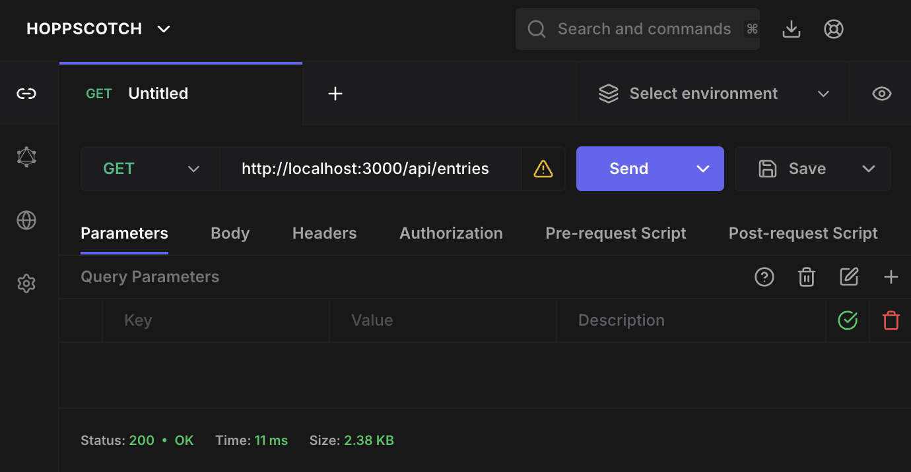
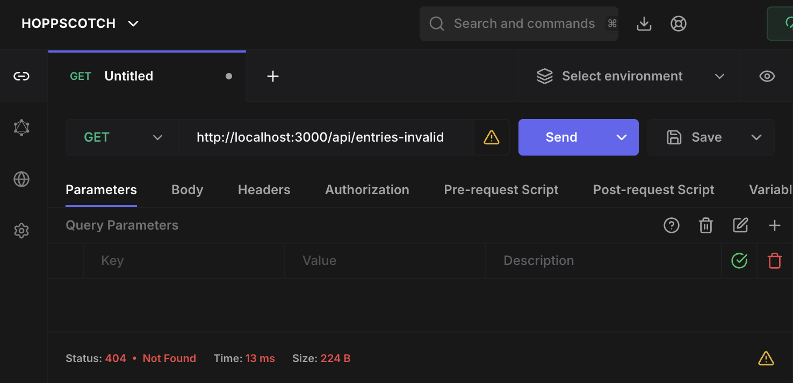
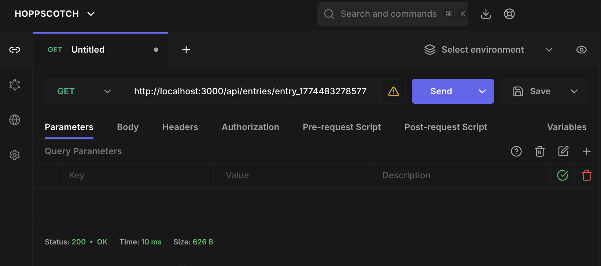
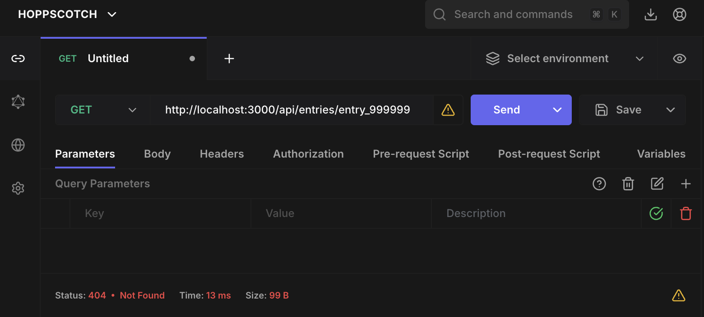
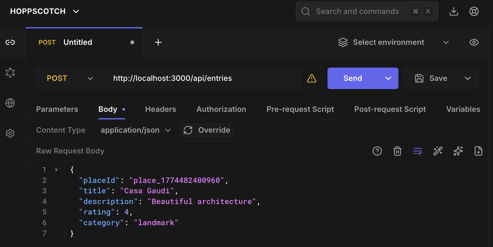
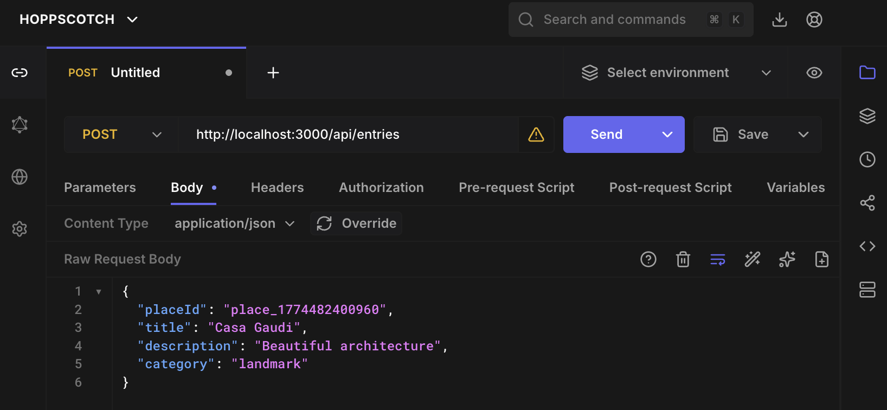
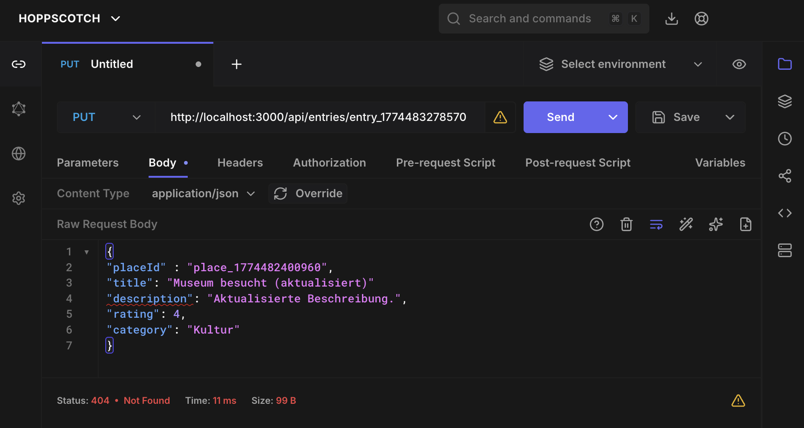
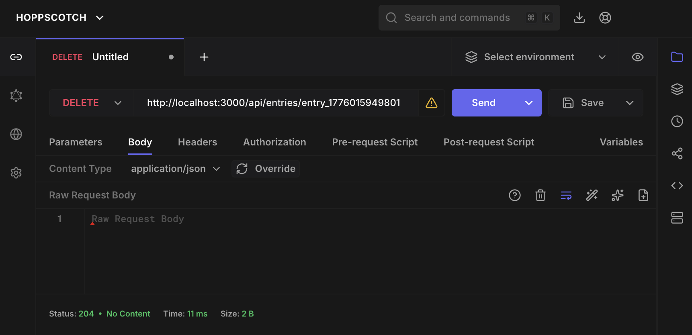
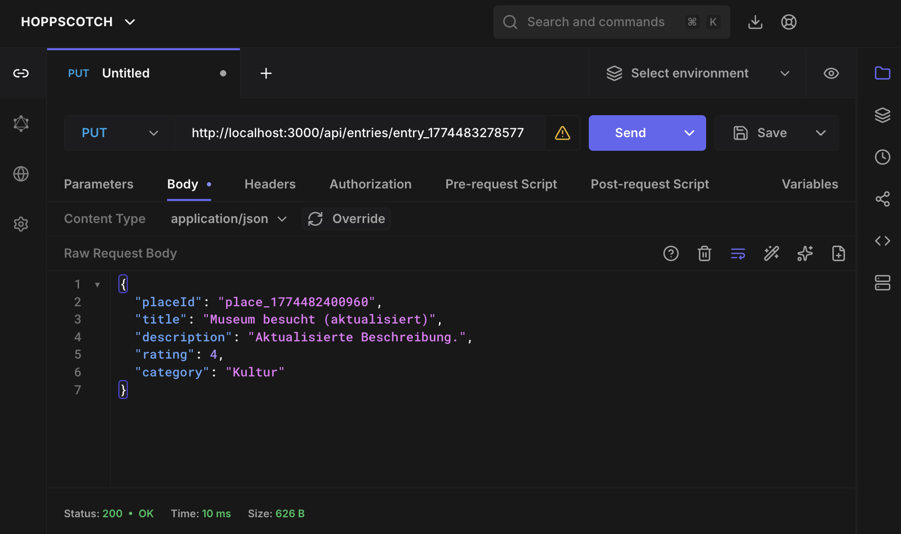
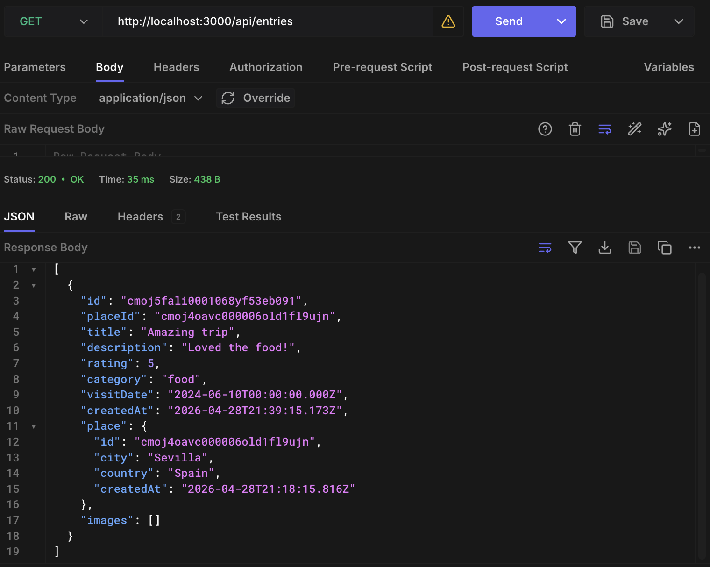

# web_architecture_VIS2026

## Studio Session 02: Frontend-Architekturen

### Braucht eure App SSR/Next.js – oder wäre Vite eigentlich besser geeignet? Begründet anhand von SEO und Interaktivität.

A: Für meine Travel-Diary-App ist Vite aktuell besser geeignet, weil die App vor allem interaktiv ist (z.B. Orte auswählen und Einträge hinzufügen). SEO ist hier nicht so wichtig, da es keine öffentliche Website ist. Next.js wäre erst sinnvoll, wenn Inhalte über Suchmaschinen gefunden werden sollen.

## Studio Session 03: API Design

### Ressourcen
- **entries**: Hauptressource der App (Reisetagebuch-Einträge)
- **places**: Sekundäre Ressource (Orte)

### Hierarchie
- Ein **place** hat viele **entries** (1:n)
- Ein **entry** gehört genau zu einem **place** über `placeId`

### API-Entscheidung (flat vs. nested)
- Die CRUD-Operationen laufen zentral über **/api/entries**
- Für den Ortskontext gibt es ergänzend verschachtelte Endpunkte wie **/api/places/:placeId/entries**

### Kurzbegründung
Dieses gemischte Design hält die Hauptlogik einfach und einheitlich (flat) und macht Beziehungen zwischen Orten und Einträgen trotzdem klar lesbar (nested). Dadurch bleibt die API leicht verständlich und gut erweiterbar.

## CRUD-API

### Ressource
Die CRUD-API in diesem Abschnitt bezieht sich nur auf die Hauptressource **entries**.

### Endpunkte
- `GET /api/entries` - alle Einträge abrufen
- `GET /api/entries/:id` - einen Eintrag über die ID abrufen
- `POST /api/entries` - neuen Eintrag erstellen
- `PUT /api/entries/:id` - bestehenden Eintrag aktualisieren
- `DELETE /api/entries/:id` - Eintrag löschen

### Pflichtfelder (bei Erstellung/Aktualisierung)
- `placeId`
- `title`
- `description`
- `rating`
- `category`

### Statuscodes
- `201` bei erfolgreichem Erstellen
- `204` bei erfolgreichem Löschen
- `404`, wenn ein Eintrag nicht gefunden wurde
- `400`, wenn Pflichtfelder fehlen

## API-Tests (ohne Frontend)

### Ziel
In diesem Schritt werden nur die 5 CRUD-Endpunkte der Ressource `entries` mit Hoppscotch getestet.
Basis-URL: `http://localhost:3000`

### Hoppscotch-Testplan
- Pro Endpoint genau 2 Tests durchführen: 1x Erfolgsfall, 1x Fehlerfall
- Für jeden Test den Statuscode prüfen

### Testfälle

#### 1. GET /api/entries
Erfolgsfall:
- Methode/URL: `GET http://localhost:3000/api/entries`
- Erwartet: `200`

Fehlerfall:
- Methode/URL: `GET http://localhost:3000/api/entries-invalid`
- Erwartet: `404`

#### 2. GET /api/entries/:id
Erfolgsfall:
- Methode/URL: `GET http://localhost:3000/api/entries/:id` (mit existierender `id`)
- Erwartet: `200`

Fehlerfall:
- Methode/URL: `GET http://localhost:3000/api/entries/entry_999999`
- Erwartet: `404`

#### 3. POST /api/entries
Erfolgsfall:
- Methode/URL: `POST http://localhost:3000/api/entries`
- Erwartet: `201`

Fehlerfall:
- Methode/URL: `POST http://localhost:3000/api/entries`
- Erwartet: `400`

#### 4. PUT /api/entries/:id
Erfolgsfall:
- Methode/URL: `PUT http://localhost:3000/api/entries/:id` (mit existierender `id`)
- Erwartet: `200`

Fehlerfall:
- Methode/URL: `PUT http://localhost:3000/api/entries/entry_1774483278570`
- Erwartet: `404`

#### 5. DELETE /api/entries/:id
Erfolgsfall:
- Methode/URL: `DELETE http://localhost:3000/api/entries/:id` (mit existierender `id`)
- Erwartet: `204`

Fehlerfall:
- Methode/URL: `DELETE http://localhost:3000/api/entries/entry_1774483278570`
- Erwartet: `404`

## Prompt-Iterationen

### Iteration 1
**Prompt (zu vage):**
"Erstelle eine CRUD-API für entries in Express."

**Problem:**
Die Antwort war funktional, aber unvollständig für die Anforderungen: Statuscodes wurden nicht konsistent definiert (z. B. bei Fehlerfällen), und die gesamte Logik landete in `server.js`. Dadurch wurde der Code schwerer wartbar und schlechter strukturiert.

### Iteration 2
**Prompt (präzise):**
"Implementiere eine vollständige CRUD-API für `entries` mit klaren Statuscodes (200/201/204/400/404) und lagere die Routen in separate Dateien unter `routes/` aus; `server.js` soll nur App-Konfiguration enthalten."

**Verbesserung:**
Die Ergebnisse waren deutlich besser: konsistente Statuscodes, saubere Trennung von Routing und App-Setup sowie eine klarere, modularere Struktur. Damit wurde die API robuster, testbarer und besser für die weitere Erweiterung (z. B. Nested Routes mit `places`) vorbereitet.

## Erweiterung: zweite Ressource

Zusätzlich zur Hauptressource wurde eine Beziehung zwischen `places` und `entries` als nested API umgesetzt.

Ein `place` kann mehrere `entries` enthalten. Diese Beziehung wird über folgende Endpunkte abgebildet:

- `GET /api/places/:id/entries` – alle Einträge eines Ortes abrufen
- `POST /api/places/:id/entries` – neuen Eintrag für einen Ort erstellen

Wenn der angegebene Ort nicht existiert, wird ein `404 Not Found` zurückgegeben.

Diese nested API ergänzt das flache CRUD-Design sinnvoll, ohne die API unnötig komplex zu machen.

## Studio Session 04: Persistenz 

## Datenmodell

### Tabellen-Skizze

| Tabelle     | Wichtige Felder                                                         | PK | FK                    |
|-------------|--------------------------------------------------------------------------|----|-----------------------|
| places      | id, city, country, createdAt                                             | id | –                     |
| entries     | id, placeId, title, description, rating, category, visitDate, createdAt | id | placeId -> places.id  |
| trips       | id, name, createdAt                                                      | id | –                     |
| wishlist    | id, place, country, status, note, createdAt                              | id | –                     |
| entryImages | id, entryId, imageUrl, createdAt                                         | id | entryId -> entries.id |

### Beziehungen

- places 1:n entries
- entries 1:n entryImages
- trips n:m entries (typisch ueber Zwischentabelle, z. B. tripEntries mit tripId + entryId)
- wishlist ist in diesem Modell eigenstaendig (keine direkte FK-Beziehung)

### Pflichtfelder 

- places: id, city, country, createdAt
- entries: id, placeId, title, description, rating, category, createdAt
- trips: id, name, createdAt
- wishlist: id, place, country, status, createdAt
- entryImages: id, entryId, imageUrl, createdAt

## Die Mock-Daten-Handler ersetzen

Iteration 1
Prompt:
"Ersetze die Mock-Daten-Handler durch Prisma-Queries."

Problem:
Der Prompt war zu allgemein. Die Antwort hat zwar Prisma benutzt, aber das Error-Handling war nicht klar genug definiert. Vor allem fehlten saubere Regeln für 400, 404 und 500, wodurch die API uneinheitlich wirkt.

Iteration 2
Prompt:
"Ersetze die Mock-Daten-Handler durch Prisma-Queries. Nutze bei ID-basierten Routen ein where-Objekt, fange Fehler mit try/catch ab und gib bei Datenbankfehlern 500 zurück."

Verbesserung:
Die zweite Version war deutlich besser. Die Queries waren genauer formuliert, die Fehlerbehandlung war klarer und die API verhielt sich konsistenter. Dadurch wurde der Code verständlicher, robuster und besser für den weiteren Ausbau geeignet.

## Persistenz-Test

Um zu überprüfen, ob die Daten dauerhaft in der Datenbank gespeichert werden, wurde folgender Test durchgeführt:

1. Der Server wurde gestartet und über Hoppscotch ein neuer Eintrag mittels "POST"-Request erstellt.
2. Der Server wurde gestoppt ("Ctrl + C").
3. Der Server wurde erneut gestartet.
4. Mit einem "GET"-Request wurden alle Einträge abgerufen.

**Ergebnis:**
Der zuvor erstellte Eintrag war nach dem Neustart des Servers weiterhin vorhanden. Dies bestätigt, dass die Daten korrekt in der SQLite-Datenbank über Prisma gespeichert werden.

## Architekturentscheidung

Strukturierte Daten wie Places, Entries und Trips werden in der Datenbank gespeichert, da sie miteinander verknüpft sind und konsistent abgefragt werden müssen. 

Für größere Dateien wie Bilder wäre langfristig ein Cloud Object Store wie S3 sinnvoll, da dieser besser für Medien geeignet ist. Redis könnte zusätzlich für Caching genutzt werden, um die Performance bei häufigen Anfragen zu verbessern.

## Studio Session 05: Security, Authentifizierung & Autorisierung

## Lücken in API

### Welche drei Dinge kann ein anonymer Nutzer mit eurer aktuellen API anstellen, die er nicht dürfte?

Da die API komplett offen ist, kann ein anonymer Nutzer:

**Alle Daten auslesen (GET):**  
Über Endpunkte wie "/api/entries" oder "/api/places" konnte jeder Nutzer alle gespeicherten Daten einsehen, auch die von anderen Nutzern.

**Fremde Daten löschen (DELETE):**  
Durch Aufrufe wie "DELETE /api/entries/:id" oder "DELETE /api/places/:id" konnte ein anonymer Nutzer beliebige Einträge oder Orte löschen – unabhängig davon, wer sie erstellt hat.

**Daten anderer Nutzer manipulieren:**  
Da keine Authentifizierung oder Autorisierung vorhanden war, konnte ein Nutzer gezielt IDs erraten oder auslesen und so Daten anderer Nutzer verändern oder entfernen.

Diese Lücken zeigen, dass ohne Authentifizierung und Zugriffskontrolle keine Datensicherheit gewährleistet ist.

## authenticate-Middleware

### Was passiert, wenn jemand versuchen würde, den JWT-Payload manuell verändert (z.B. die userId auf eine fremde ändert)? Warum funktioniert das nicht?

A: Wenn jemand versuchen würde, den JWT-Payload manuell zu verändern (z. B. die userId zu manipulieren), würde das nicht funktionieren. Der JWT ist mit einem geheimen Schlüssel (JWT_SECRET) signiert. Sobald der Payload verändert wird, stimmt die Signatur nicht mehr mit dem Token überein. Bei der Überprüfung mit jsonwebtoken.verify() wird das Token daher als ungültig erkannt und der Server antwortet mit einem 401 Unauthorized Fehler.

## Security OWASP Audit 

| OWASP Punkt | Status | Ergebnis / Begründung | Empfohlener Fix |
|---|---|---|---|
| **A01 Broken Access Control** | Abgedeckt | Alle geschützten Routen erfordern `authenticate` Middleware. DB-Abfragen filtern nach `userId`. Benutzer können nicht auf Daten anderer zugreifen. | Keine Änderung erforderlich |
| **A02 Cryptographic Failures** | Abgedeckt | Passwörter werden mit bcrypt (10 Saltrounds) gehasht. JWT wird als HttpOnly-Cookie gespeichert. JWT_SECRET aus `.env`. Ablaufzeit 24h. Plaintext-Passwörter werden nie zurückgegeben. | Keine Änderung erforderlich |
| **A03 Injection** | Teilweise | DB-Queries: Prisma schützt vor SQL-Injection. Directory Traversal: `filePathFromUrl()` in `routes/entries.js` validiert nicht Dateipfade. Angreifer könnte `../` zur Dateilöschung außerhalb von `/uploads` nutzen. | Pfadvalidierung mit `path.resolve()` und Verzeichnischeck hinzugefügt (entries.js) |
| **A07 Authentication Failures** | Teilweise | User Enumeration: Login nutzt identische Fehlermeldung. Passwort-Stärke: Keine Validierung. JWT Expiration: 24h konfiguriert. | Mindestkontrolle für 8 Zeichen bei Register hinzugefügt (auth.js) |

## Studio-Session 06: Testing

## Die Test-Pyramide

| Ebene | Was testen wir bei uns? | Tool |
|---|---|---|
| Unit | Validierungsfunktionen für Eingaben, z. B. Pflichtfelder, Rating-Bereich, E-Mail-/Passwort-Regeln | Vitest |
| Integration | Backend-Routen mit Prisma-Testdatenbank, z. B. POST /api/places, POST /api/entries, Login, geschützte Routen und Ownership-Checks | Vitest + Supertest |
| E2E | Kompletter Nutzerfluss im Browser: Registrieren/Login, Ort anlegen, Diary Entry erstellen, Logout/Login, Daten weiterhin sichtbar | Cypress |

### Welche zwei Dinge in eurem Projekt würden den meisten Schaden anrichten, wenn sie kaputt gehen bei einer Änderung durch den Agenten?

1. Authentifizierung und Autorisierung:
	- Login muss funktionieren.
	- JWT-Cookie muss korrekt gesetzt und gelesen werden.
	- Geschützte Routen dürfen ohne Login nicht erreichbar sein.
	- Nutzer dürfen nur ihre eigenen Places, Entries, Trips und Wishlist-Daten sehen oder verändern.

2. Persistenz und Entry-Erstellung:
	- Places und Entries müssen über Prisma korrekt in der Datenbank gespeichert werden.
	- Ein Diary Entry muss mit dem richtigen Place und dem richtigen User verbunden sein.
	- Nach einem Backend-Neustart müssen gespeicherte Daten weiterhin vorhanden sein.

## Studio Session 07: Real-time Web

## Echtzeit-Bedarfs

In WanderNotes: My Diary App können sich Daten wie Reisen, Orte und Tagebucheinträge ändern, während ein anderer Browser-Tab oder ein anderes Gerät geöffnet ist. Da die App aktuell als persönliches Reisetagebuch genutzt wird und keine gemeinsame Bearbeitung unterstützt, reicht ein Neuladen der Seite grundsätzlich aus. Echtzeit-Updates verbessern jedoch die Benutzererfahrung, wenn dieselbe Person die App in mehreren Tabs oder auf mehreren Geräten verwendet.

Für dieses Web-app ist eine einseitige Kommunikation vom Server zum Client ausreichend. Der Server muss die verbundenen Clients nur darüber informieren, dass neue Daten verfügbar sind, damit diese ihre Listen aktualisieren können. Da WanderNotes nur wenige gleichzeitige Nutzer erwartet, ist Server-Sent Events (SSE) die passendere Lösung. WebSockets wären erst bei Funktionen wie Chat, gemeinsamer Bearbeitung oder anderen interaktiven Echtzeit-Anwendungen sinnvoll.

## Zwei Prompt-Iterationen für die SSE-Implementierung

### Prompt 1

Im ersten Prompt sollte der Agent das Projekt analysieren und entscheiden, welche Ressource sich am besten für Server-Sent Events eignet. Außerdem sollte er die betroffenen Dateien, den Ablauf der Kommunikation sowie mögliche Probleme mit Authentifizierung und CORS nennen. Noch sollten keine Dateien geändert werden.

### Prompt 2

Im zweiten Prompt wurde die Aufgabe genauer beschrieben. Der Agent sollte die SSE-Funktion nur für Orte umsetzen, den vorhandenen Backend-Port verwenden, den Endpunkt mit der bestehenden Authentifizierung schützen und ein Event mit dem Namen `place-created` senden. Zusätzlich wurde festgelegt, dass keine privaten Ortsdaten übertragen werden, der `EventSource` im Frontend geschlossen wird und keine anderen Funktionen verändert werden.

### Was wurde im zweiten Prompt verbessert?

Der zweite Prompt war genauer und hat mögliche Fehler aus dem ersten Entwurf verhindert. Besonders wichtig waren die richtige Backend-URL, die Nutzung des HttpOnly-Cookies, der genaue Event-Name, das Schließen der Verbindung und die Begrenzung auf kleine Änderungen. Dadurch konnte der Agent die Funktion gezielter und sicherer umsetzen.

## Zwei Prompt-Iterationen für die Socket.IO-Implementierung

### Prompt 1

Im ersten Prompt sollte der Agent die Socket.IO-Funktion für WanderNotes umsetzen. Dabei sollten eine Verbindung zwischen Backend und Frontend hergestellt, Ereignisse für neue Orte übertragen und die bestehende REST-API weiterhin für das Erstellen von Orten verwendet werden.

### Prompt 2

Im zweiten Prompt wurde die Aufgabe genauer beschrieben. Es wurde festgelegt, dass nur die notwendigen Änderungen vorgenommen werden sollen, die bestehenden SSE-Funktionen erhalten bleiben und nur die benötigten Pakete (`socket.io` und `socket.io-client`) installiert werden. Außerdem wurde beschrieben, wie das Event `place-created` zwischen den Browser-Tabs übertragen werden soll.

### Was wurde im zweiten Prompt verbessert?

Der zweite Prompt war präziser und hat den Umfang der Änderungen klar eingeschränkt. Dadurch wurden unnötige Änderungen vermieden und die neue Socket.IO-Funktion sauber in die bestehende Architektur integriert, ohne die bereits funktionierende SSE-Implementierung zu verändern.

## Vergleich: Server-Sent Events vs. WebSockets

| Kriterium | SSE | WebSockets |
|-----------|-----|------------|
| **Richtung** | Server → Client | Bidirektional (Client ↔ Server) |
| **Komplexität im Code** | Gering | Mittel |
| **Reconnect bei Verbindungsabbruch** | Automatisch durch den Browser | Socket.IO stellt die Verbindung automatisch wieder her |
| **Geeignet für WanderNotes?** | ✅ Ja | ✅ Ja |
| **Warum?** | Reicht aus, um andere Clients über neue Orte zu informieren. | Ermöglicht bidirektionale Kommunikation, ist für die aktuelle Version der App aber eigentlich nicht notwendig. |

### Verhalten bei einem Server-Neustart

Wenn der Server neu gestartet wird, wird die Verbindung zunächst unterbrochen. Während dieser Zeit werden keine Echtzeit-Nachrichten übertragen. Nach dem Neustart stellen sowohl Server-Sent Events als auch Socket.IO die Verbindung automatisch wieder her und die App kann wieder neue Ereignisse empfangen.

## Den Agenten als Architekt einsetzen

Der Agent empfiehlt, Echtzeit-Kommunikation nur für die Ortsliste zu verwenden, damit mehrere geöffnete Browser-Tabs automatisch synchron bleiben. Für Reisen, Tagebucheinträge und die Bucket List reicht in der aktuellen Version der App ein normales Neuladen der Daten oder einfaches Polling aus, da diese Funktionen keine sofortige Aktualisierung benötigen. Außerdem passt dieser Ansatz gut zur bestehenden REST-Architektur und vermeidet unnötige Komplexität. Ich stimme dieser Einschätzung zu, da WanderNotes aktuell hauptsächlich von einer Person genutzt wird und Echtzeit-Kommunikation nur an wenigen Stellen einen echten Mehrwert bietet.

## Study Session 08: Async Messaging

### Analyse des Benachrichtigungsbedarfs

| Event in WanderNotes | Benachrichtigung sinnvoll? | Typ | Kanal | Begründung |
|---|---|---|---|---|
| Erfolgreiche Registrierung | Ja | Transactional | E-Mail | Der Nutzer erhält eine Bestätigung, dass das Konto erfolgreich erstellt wurde. Die Nachricht kann auch einen direkten Link zur Anmeldung enthalten. |
| Monatliche Erinnerung an Bucket-List-Einträge | Ja, optional | Product | E-Mail | Die Nachricht erinnert den Nutzer an gespeicherte Reiseziele, die noch nicht besucht wurden. Da die Erinnerung nicht dringend ist, reicht eine E-Mail aus. |
| Erinnerung an eine Reise vor einem Jahr | Ja, optional | Product | E-Mail | Der Nutzer kann am gleichen Datum an eine frühere Reise erinnert werden, zum Beispiel an einen Besuch in Madrid vor einem Jahr. Die E-Mail könnte einen Link zum passenden Tagebucheintrag enthalten. |
| Neuer Ort oder Tagebucheintrag wurde erstellt | Nein | – | Keiner | Der Nutzer erstellt diese Inhalte selbst und sieht das Ergebnis sofort in der App. Eine zusätzliche Nachricht wäre nicht notwendig. |
| Passwort wurde geändert | Später sinnvoll | Transactional | E-Mail | Eine Sicherheitsnachricht wäre sinnvoll, damit der Nutzer eine nicht selbst ausgeführte Änderung schnell erkennen kann. Diese Funktion wird aktuell nicht umgesetzt, da WanderNotes noch keine Passwortänderung oder Passwort-Zurücksetzung besitzt. |

**Muss der Nutzer bei einem Event sofort reagieren?**

Nein. Die geplanten Benachrichtigungen sind nicht dringend und können später gelesen werden. Deshalb ist E-Mail für WanderNotes geeigneter als Web Push.

**Ist Marketing-Content geplant?**

Aktuell ist kein klassischer Marketing-Content geplant. Die monatliche Bucket-List-Erinnerung und die Reise-Erinnerung wären freiwillige Produktnachrichten. Der Nutzer sollte diese Nachrichten aktiv einschalten oder wieder deaktivieren können.

**Wie viele Events würden pro Stunde Benachrichtigungen auslösen?**

Es würden nur wenige Benachrichtigungen entstehen. Die Registrierungs-E-Mail wird nur einmal pro neuem Nutzer gesendet. Die anderen Erinnerungen würden höchstens einmal im Monat oder an einem bestimmten Jahrestag versendet.

### Entscheidung

Für die praktische Umsetzung wir eine transaktionale E-Mail nach der erfolgreichen Registrierung verwendet. Diese Funktion passt bereits zur aktuellen Struktur von WanderNotes und benötigt keine neue Passwortverwaltung. Die monatliche Bucket-List-Erinnerung und die Erinnerung an frühere Reisen sind sinnvolle Ideen für eine spätere Erweiterung, benötigen aber zusätzlich eine geplante Hintergrundaufgabe. Web Push wird nicht umgesetzt, da aktuell keine Benachrichtigung eine sofortige Reaktion verlangt.

## Transactionale Registrierungs-E-Mail

Für WanderNotes wurde eine transaktionale E-Mail nach einer erfolgreichen Registrierung umgesetzt. Die E-Mail bestätigt, dass das Benutzerkonto erstellt wurde, und enthält einen direkten Link zur Login-Seite von WanderNotes.

### Prompt-Iteration 1

Im ersten Prompt wurde der Agent gebeten, eine Registrierungs-E-Mail mit Resend und React Email zu planen. Das Template sollte eine Bestätigung und einen direkten Link zur Login-Seite enthalten. Außerdem sollte der Versand den HTTP-Request nicht blockieren.

Der erste Plan enthielt jedoch zwei Annahmen: Der Agent plante eine JSX-Datei im Backend und nahm zunächst an, dass die Route `/login` existiert.

### Prompt-Iteration 2

Im zweiten Prompt wurde präzisiert, dass der Agent zuerst die echte Login-Route prüfen soll. Außerdem sollte kein JSX und kein neues Build-System eingeführt werden. Stattdessen sollte das E-Mail-Template als normale `.js`-Datei mit `React.createElement` umgesetzt werden.

### Testergebnis

Die Registrierung wurde erfolgreich abgeschlossen, obwohl der E-Mail-Versand bei einigen Tests nicht zugestellt werden konnte. Resend akzeptiert die Anfrage für die hinterlegte Testadresse, aber der E-Mail-Provider der Hochschule meldet einen temporären Bounce. Beim Test mit einer anderen Adresse blockierte Resend den Versand wegen der Einschränkungen des Test-Absenders.

Wichtig ist, dass die Registrierung in beiden Fällen erfolgreich geblieben ist. Damit wurde bestätigt, dass der E-Mail-Versand den HTTP-Request nicht blockiert und Fehler korrekt behandelt werden.

### Bewertung und Verbesserung des E-Mail-Templates

Das E-Mail-Template wurde anhand der vorgegebenen Kriterien überprüft.

| Kriterium | Bewertung |
|---|---|
| Sind alle wichtigen Informationen enthalten? | Ja. Die E-Mail informiert den Nutzer darüber, dass die Registrierung erfolgreich abgeschlossen wurde. |
| Enthält die E-Mail einen direkten Link? | Ja. Ein Button führt direkt zur Login-Seite von WanderNotes. Zusätzlich wird der Link als Text angezeigt, falls der Button nicht funktioniert. |
| Sind Titel und Inhalt kurz und verständlich? | Ja. Die Nachricht konzentriert sich auf die erfolgreiche Registrierung und enthält keine unnötigen Informationen. |
| Ist die nächste Aktion für den Nutzer klar? | Ja. Der Nutzer wird über den Button dazu aufgefordert, sich bei WanderNotes anzumelden. |

Bei der ersten Version lautete der Betreff:

`Welcome to WanderNotes - confirm your registration`

Dieser Betreff war nicht vollständig passend, weil der Nutzer seine E-Mail-Adresse nicht bestätigen muss. Das Konto wurde bereits erfolgreich erstellt. Deshalb wurde der Betreff geändert zu:

`Welcome to WanderNotes - Registration successful`

Durch diese Änderung beschreibt der Betreff den tatsächlichen Inhalt der Nachricht genauer. Weitere Änderungen am Template waren nicht notwendig, da bereits eine klare Bestätigung, ein direkter Login-Link und ein kurzer verständlicher Text vorhanden waren.

## Session 09: Modularer Monolith

## Analyse der bestehenden Backend-Struktur

| Datei | Verantwortlichkeit | Zugriff auf andere Bereiche |
|-------|--------------------|-----------------------------|
| `routes/auth.js` | Registrierung, Login, Logout sowie Prüfung des aktuell angemeldeten Benutzers. Zusätzlich werden Passwörter gehasht, JWTs erstellt bzw. geprüft und Bestätigungs-E-Mails ausgelöst. | Kein direkter Zugriff auf andere Datenmodelle. Es wird jedoch der separate E-Mail-Service aufgerufen. |
| `routes/entries.js` | Verwaltung der Tagebucheinträge einschließlich Erstellen, Bearbeiten, Löschen sowie Bildverwaltung und Datei-Uploads. | Ja. Es wird direkt auf das `Place`-Modell zugegriffen, um Orte und deren Besitzer zu prüfen. |
| `routes/places.js` | Verwaltung der besuchten Orte sowie Erstellung und Löschung von Orten. Beim Löschen werden außerdem zugehörige Bilder entfernt und nach dem Erstellen ein SSE-Ereignis ausgelöst. | Ja. Die Datei greift direkt auf Einträge und deren Bilder zu. |
| `routes/trips.js` | Verwaltung von Reisen, Reiseeinträgen und Reiseelementen. Die Daten werden in einer JSON-Datei gespeichert. | Ja. Beim Hinzufügen eines Eintrags wird direkt auf das `Entry`-Modell zugegriffen. |
| `routes/wishlist.js` | Verwaltung der Reisewunschliste mit Erstellen, Bearbeiten und Löschen von Wunschzielen. Die Daten werden in einer JSON-Datei gespeichert. | Nein. Die Datei verwendet ausschließlich ihre eigene Datenquelle. |
| `server.js` | Zentraler Einstiegspunkt des Backends. Hier werden Express, Middleware, Authentifizierung, Router, SSE, Socket.IO sowie der Server konfiguriert. | Nein. Die Datei verbindet lediglich die einzelnen Module miteinander. |

## Ergebnisse der Code-Analyse

- `auth.js:11`, `auth.js:35` und `auth.js:90` enthalten fachliche Logik für Registrierung, Login und Session-Prüfung: Pflichtfeldprüfung, Passwort-Hashing, JWT-Erzeugung, Cookie-Handling und E-Mail-Versand.

- `entries.js:115`, `entries.js:176`, `entries.js:266`, `entries.js:298` und `entries.js:331` bündeln neben Routing auch Validierung, Platzprüfung, Bild- und Dateiverwaltung sowie die Erzeugung, Aktualisierung und Löschung von Einträgen.

- `places.js:61` und `places.js:91` enthalten fachliche Logik für das Anlegen und Löschen von Orten inklusive SSE-Broadcast und Dateilöschung.

- `trips.js:36`, `trips.js:58`, `trips.js:101`, `trips.js:111` und `trips.js:135` mischen Routing mit Geschäftsregeln für die JSON-basierte Trip-Verwaltung, Entry-Verknüpfung und Item-Zustände.

- `wishlist.js:32`, `wishlist.js:55` und `wishlist.js:71` mischen Routing mit JSON-Persistenz, Status-Normalisierung und Benutzerfilterung.

- `entries.js:128`, `entries.js:201` und `entries.js:308` greifen direkt auf `prisma.place` zu, um Einträge gegen die Places-Domäne zu prüfen.

- `places.js:96` lädt beim Löschen eines Ortes auch `entries` und `entryImages`. Dadurch ist die Places-Route direkt an Eintrags- und Bilddaten gekoppelt.

- `trips.js:68` prüft Trip-Verknüpfungen mit `prisma.entry` und hängt damit direkt an der Entries-Domäne.

- `auth.js:23` ist zusätzlich an die Mail-Service-Logik für Registrierungsbestätigungen gekoppelt.

- Wiederholte Logik taucht in mehreren Routen auf:
  - `asyncHandler` in `entries.js:26`, `places.js:15`, `trips.js:14` und `wishlist.js:11`
  - `isMissing` in `entries.js:30` und `places.js:19`
  - Datei-Löschlogik in `entries.js:44` und `places.js:21`
  - JSON lesen, schreiben und nach `userId` filtern in `trips.js:18` und `wishlist.js:15`
  - Status-Whitelists in `trips.js:119` und `wishlist.js:38`

  ## Identifizierte Bounded Contexts

Auf Grundlage der bestehenden Routen und ihrer fachlichen Verantwortlichkeiten wurden vier Bounded Contexts identifiziert:

1. **Authentication**

   Dieser Bereich umfasst die Registrierung, den Login, den Logout, die Passwortverarbeitung, JWTs, Cookies und den Versand der Registrierungsbestätigung.

   Zugehörige bestehende Datei:

   - `routes/auth.js`

2. **Travel Journal**

   Dieser Bereich umfasst besuchte Orte, Tagebucheinträge und die zugehörigen Bilder. Orte und Einträge gehören fachlich eng zusammen, da jeder Eintrag einem Ort zugeordnet ist. Beim Löschen eines Ortes müssen außerdem die zugehörigen Einträge und Bilder berücksichtigt werden.

   Zugehörige bestehende Dateien:

   - `routes/places.js`
   - `routes/entries.js`

3. **Trip Planning**

   Dieser Bereich verwaltet Reisen, die Verknüpfung von Tagebucheinträgen mit Reisen sowie einzelne Reiseelemente.

   Zugehörige bestehende Datei:

   - `routes/trips.js`

4. **Wishlist**

   Dieser Bereich verwaltet unabhängige Wunschziele mit Ort, Land, Status und Notiz.

   Zugehörige bestehende Datei:

   - `routes/wishlist.js`

### Kommunikation zwischen den Bounded Contexts

Der **Authentication**-Kontext stellt den übrigen Bereichen die Identität des angemeldeten Benutzers (`userId`) zur Verfügung, damit diese ausschließlich auf die eigenen Daten zugreifen können. Der **Trip Planning**-Kontext kommuniziert mit dem **Travel Journal**-Kontext, um das Vorhandensein und den Besitzer eines Tagebucheintrags (`entryId`, `placeId`, `userId`) zu prüfen, während der **Wishlist**-Kontext derzeit unabhängig von den übrigen Bereichen arbeitet.

### Service Layer

#### Prompt-Iteration 1

Refaktoriere ausschließlich den `POST /places`-Handler. Verschiebe die Validierung, den Prisma-Create-Aufruf sowie den SSE-Broadcast in eine neue Service-Funktion `createPlace(data, userId)`. Der Route-Handler soll nur noch die Anfrage entgegennehmen, den Service aufrufen und die HTTP-Antwort zurückgeben. Andere Handler dürfen nicht verändert werden.

#### Prompt-Iteration 2

Refaktoriere ausschließlich den `createEntryHandler`. Erstelle dafür eine Service-Funktion `createEntry(data, files, userId, routePlaceId)` und verschiebe die Validierung, die Prüfung des zugehörigen Ortes, die Bildverarbeitung sowie die Prisma-Logik in den Service. Die bestehenden Endpunkte, die Middleware sowie die HTTP-Antworten sollen unverändert bleiben.

#### Verbesserung der zweiten Iteration

Der zweite Prompt war präziser formuliert, da die auszulagernde Geschäftslogik sowie die unveränderten Bestandteile der Route (Endpunkte, Middleware und HTTP-Antworten) eindeutig beschrieben wurden. Dadurch konnte die Service-Struktur gezielter umgesetzt werden.

### Modul-Schnittstellen

#### travel-journal/entries.service.js

**Öffentlich:**
- createEntry()

**Intern:**
- parseList()
- createServiceError()

#### travel-journal/places.service.js

**Öffentlich:**
- createPlace()

**Intern:**
- keine

### Vorbereitung auf eine mögliche Microservice-Architektur

Das Wishlist-Modul wäre am einfachsten als eigenständiger Microservice auszulagern, da es derzeit stark isoliert ist und keine Abhängigkeiten zu den anderen fachlichen Modulen besitzt. Es verwendet nur seine eigene JSON-Persistenz, während beispielsweise das Trip-Planning-Modul bereits auf Daten aus dem Travel-Journal angewiesen ist.

